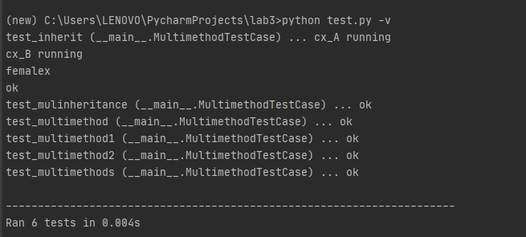

# CPO_lab3
1. Title: Computational Process Organization Lab3

2. List of group members: Chen Sihan 192050195, Yue Xueying 192050217

3. Laboratory work number: 2

    Variant description: 
    1. The library should support multiple-dispatch on positional, optional and named arguments.
    2. Your library should be well documented.
    3. To proof correctness, you should use unit tests with several multi-methods, which works with standard Python types and user-definedtypes.
    4. You should demonstrate how it works with inheritances and multiple inheritances.
    5. It will be preferred if you design a complex real-world example. 

4. Synopsis: 
    We wrote three files that support multiple dispatch on positional, optional and named arguments.

5. Contribution summary for each group member (should be checkable by git log and git blame):
    XueyingYue design the multiple dispatch library, and Chen Sihan test the library.

6. Explanation of taken design decisions and analysis: 
    We design this multidispatch library by using decorators and MultiMethod class. Our file can achieve overloading of different parameter types under the same name function. In test.py file, we have achieved inheritances. In testoptional.py file, we can use the "foo" function regardless of number of parameters. Lastly, in testname.py file, we test the function of named arguments. In this case, we used named arguments to test "foo" funtion.

7. Test result:

    
